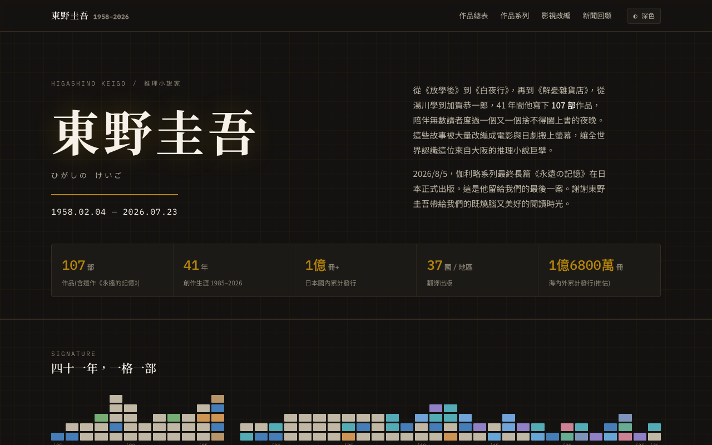

# 東野圭吾作品紀念館 使用說明

## 這是什麼？
東野圭吾全部 107 部作品的線上紀念館，整理作品簡介、系列脈絡、影視改編與台灣購書連結。

## 使用方式
1. 首頁瀏覽作品年表（四十一年，一格一部）
2. 點擊「作品總表」查看完整書單
3. 點擊「作品系列」查看加賀恭一郎、湯川學等系列脈絡
4. 「影視改編」查看電影與日劇改編清單
5. 「新聞回顧」瀏覽相關報導
6. 右上角可切換深色/淺色模式

## 功能特色
- 107 部作品完整收錄（含遺作《永遠的記憶》）
- 41 年創作生涯年表視覺化
- 37 國翻譯出版資訊
- 影視改編對照
- 深色/淺色主題切換

## 注意事項
- 純靜態網頁，可離線瀏覽
- 線上版：GitHub Pages
